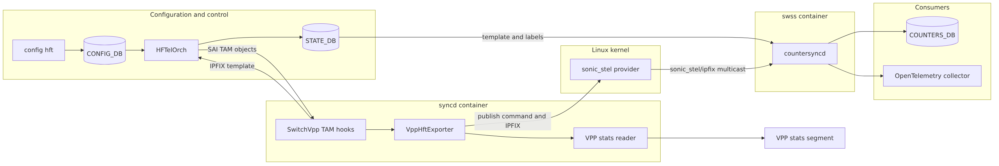
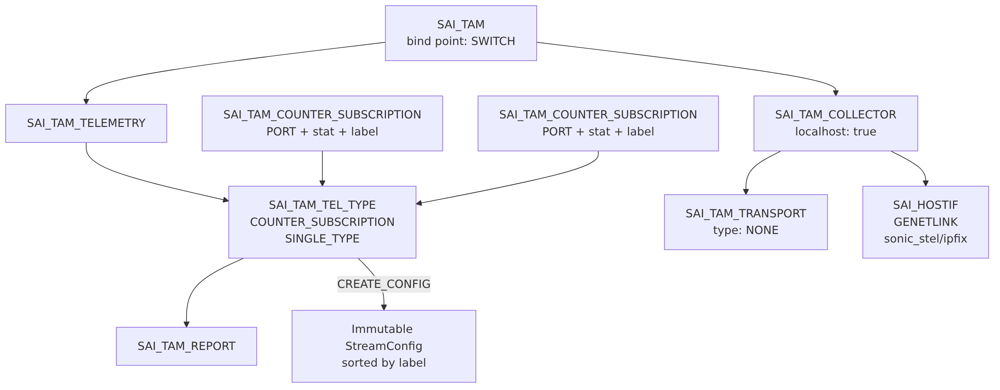
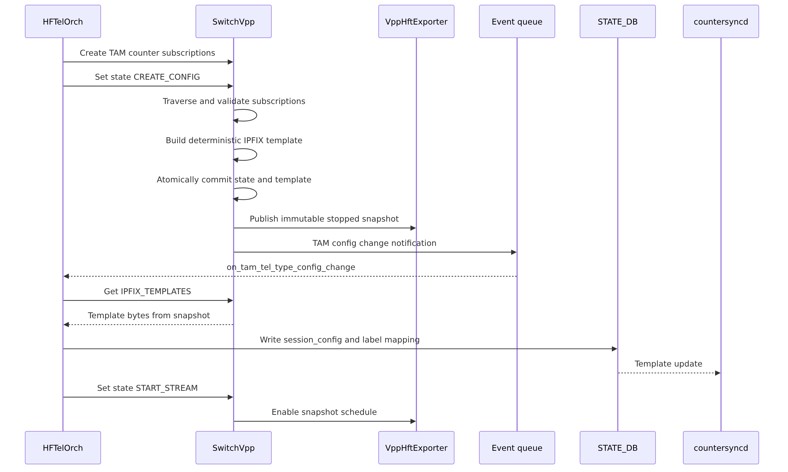
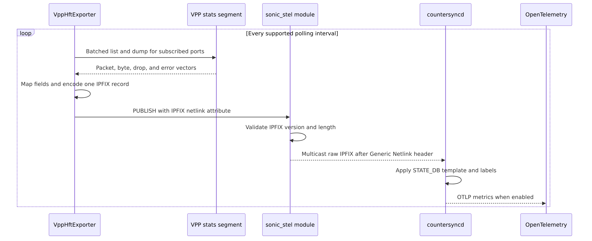
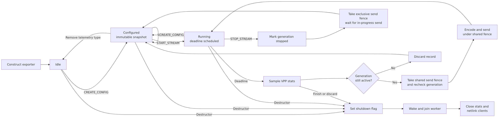

# High frequency telemetry for the SONiC VPP platform

## Revision

| Revision | Date | Author | Description |
|---|---|---|---|
| 0.1 | 2026-08-21 | Aaron Bernardino | Design, feasibility analysis, and grounded design review for truthful PORT counter streaming on the SONiC VPP platform |

## Table of contents

1. [Scope](#1-scope)
2. [Definitions](#2-definitions)
3. [Background](#3-background)
4. [Requirements](#4-requirements)
5. [Current state and feasibility](#5-current-state-and-feasibility)
6. [Architecture](#6-architecture)
7. [SAI capability model](#7-sai-capability-model)
8. [TAM configuration and stream lifecycle](#8-tam-configuration-and-stream-lifecycle)
9. [IPFIX template and data format](#9-ipfix-template-and-data-format)
10. [VPP counter collection](#10-vpp-counter-collection)
11. [Generic Netlink transport](#11-generic-netlink-transport)
12. [Concurrency and shutdown](#12-concurrency-and-shutdown)
13. [Error handling](#13-error-handling)
14. [Build and packaging](#14-build-and-packaging)
15. [Warm restart and recovery](#15-warm-restart-and-recovery)
16. [Testing](#16-testing)
17. [Limitations and future work](#17-limitations-and-future-work)
18. [Alternatives considered](#18-alternatives-considered)
19. [File change summary](#19-file-change-summary)
20. [References](#20-references)

## 1. Scope

This document describes how the SONiC VPP platform will support high frequency telemetry for SAI PORT
counters on the `t1-lag-vpp` KVM testbed.

The design extends the general
[SONiC high frequency telemetry design](high-frequency-telemetry-hld.md). It keeps the existing CONFIG_DB,
Orchagent, SAI TAM, STATE_DB, countersyncd, and OpenTelemetry contracts. It adds the VPP specific producer
that the general design assigns to the vendor implementation.

The first implementation covers:

* Truthful streaming capability advertisement for supported PORT counters.
* IPFIX template generation from SAI TAM counter subscriptions.
* Periodic sampling from the VPP statistics segment.
* IPFIX data record generation.
* Delivery through Generic Netlink family `sonic_stel`, multicast group `ipfix`.
* PORT focused sonic-mgmt validation on `t1-lag-vpp`.

This design does not add a VPP dataplane node or patch VPP. The existing VPP statistics segment is the
counter source.

### 1.1 Scope decision at a glance

> **Decision:** V1 supports four PORT counters only. QUEUE, BUFFER_POOL, and
> INGRESS_PRIORITY_GROUP are excluded because the current VPP dataplane cannot
> identify or measure the corresponding SAI objects. This is an object model
> limitation, not an IPFIX exporter limitation.

A counter qualifies for VPP HFT only when all four conditions are true:

1. The VPP source has the same object identity as the SAI object.
2. The value has the same meaning and units as the SAI stat.
3. The source updates at the advertised HFT interval.
4. Every object and stat that VPP advertises can be sampled without copying,
   inventing, or relabeling another counter.

The feasibility study found:

| SAI surface | Live SONiC objects | Live VPP source | V1 decision |
|---|---:|---|---|
| PORT octets, discards, and errors | 32 front panel ports | Direct per-interface VPP statistics | Support four exact counters |
| PORT unicast packets | 32 front panel ports | Derivable only from DPDK xstats that refresh every 10 seconds by default | Exclude pending cadence and cost qualification |
| QUEUE | 640 queues, 20 per port | One RX and one TX DPDK queue per port, exposed only as physical `q0` totals | Exclude. The physical ring is not any one of the 20 logical SAI queues |
| INGRESS_PRIORITY_GROUP | 256 groups, 8 per port | No VPP priority-group classifier, admission model, occupancy, or watermark | Exclude. A new ingress QoS and buffer model is required |
| BUFFER_POOL | 3 SONiC ingress and egress pools | One global VPP NUMA packet-buffer allocator pool | Exclude. The allocator has different identity, units, and semantics |

The live DPDK device reports a maximum of one RX queue and one TX queue. The
`rx_q0_*` and `tx_q0_*` values aggregate all traffic on that physical ring.
They cannot be assigned to queue index 0 while queues 1 through 19 are reported
as zero, because queue 0 would then contain traffic belonging to every logical
traffic class. VPP also has no current queue occupancy, queue watermark, WRED
or ECN, ingress priority group, or per-SONiC-pool statistics.

The sonic-mgmt parser accepts zero counter values and does not require every
configured object to appear in every report. The design does not use those
test gaps to claim support. Duplicating the one physical queue or allocator
value across logical SAI objects would produce parseable IPFIX but false
telemetry.

## 2. Definitions

| Term | Meaning |
|---|---|
| HFT | High frequency telemetry |
| IPFIX | Internet Protocol Flow Information Export |
| MMU | Memory management unit |
| OTLP | OpenTelemetry Protocol |
| QoS | Quality of service |
| SAI | Switch Abstraction Interface |
| TAM | Telemetry and Monitoring |
| WRED | Weighted random early detection |
| TAM telemetry type | SAI object that defines the counter subscription stream and its state |
| Counter subscription | SAI object that binds one monitored object and stat ID to a 16 bit label |
| Stream snapshot | Immutable, validated exporter configuration built for one TAM telemetry type |
| VPP stats segment | Shared memory interface that exposes VPP counters through `/run/vpp/stats.sock` |
| Generic Netlink | Linux kernel messaging framework used by countersyncd to receive IPFIX messages |
| Provider module | Small platform kernel module that registers `sonic_stel` and multicasts IPFIX |

## 3. Background

Traditional SONiC counter collection asks syncd to poll SAI counters and write them to COUNTERS_DB.
High frequency telemetry moves the polling and report generation into the SAI implementation. The producer
pushes counter snapshots as IPFIX, which avoids one SAI request per counter interval.

The existing SONiC HFT path is:

1. The operator creates `HIGH_FREQUENCY_TELEMETRY_PROFILE` and
   `HIGH_FREQUENCY_TELEMETRY_GROUP` entries.
2. `HFTelOrch` checks SAI streaming statistics capability.
3. `HFTelOrch` creates the SAI TAM object graph and counter subscriptions.
4. SAI returns one or more IPFIX templates.
5. `HFTelOrch` publishes the templates and object label mappings to
   `HIGH_FREQUENCY_TELEMETRY_SESSION_TABLE` in STATE_DB.
6. The vendor implementation samples counters and multicasts IPFIX data messages.
7. countersyncd resolves `sonic_stel/ipfix`, parses the messages, reports statistics, writes COUNTERS_DB
   when enabled, and optionally exports OTLP.

The VPP SAI implementation already accepts most TAM object create, set, and remove calls through
`SwitchStateBase`. It does not yet implement steps 4 and 6.

## 4. Requirements

### 4.1 Goals

* Run the supported PORT subset of `tests/high_frequency_telemetry` on `t1-lag-vpp`.
* Return a valid IPFIX template for each configured PORT telemetry type.
* Sample every field in a stream from one coherent VPP statistics dump.
* Meet a target polling interval of 10,000 microseconds.
* Preserve the field order between the template and every data record.
* Start and stop emission according to the SAI TAM telemetry type state.
* Advertise only counters with a live VPP source and compatible semantics.
* Recover from temporary VPP stats and Generic Netlink failures without terminating syncd.
* Stop all exporter activity before `SwitchVpp` state is destroyed.

### 4.2 Non goals

* QUEUE counter streaming.
* BUFFER_POOL counter streaming.
* INGRESS_PRIORITY_GROUP counter streaming.
* A VPP traffic-class-to-queue scheduler, queue occupancy model, or WRED implementation.
* A VPP ingress priority group admission model.
* A SONiC MMU pool model backed by distinct VPP buffer pools.
* Fabric, switch, route, ACL, or flow counter streaming.
* Approximation of queue or MMU counters from port totals or VPP allocator totals.
* A new VPP dataplane plugin or change to the VPP patch series.
* A change to CONFIG_DB, STATE_DB, SAI TAM, IPFIX, countersyncd, or OTLP schemas.
* Seamless stream preservation across warm restart.
* Multiple SAI object types in one IPFIX template.

### 4.3 Constraints

* Existing HFT clients expect Generic Netlink family `sonic_stel` and multicast group `ipfix`.
* countersyncd expects raw IPFIX immediately after the Generic Netlink header.
* IPFIX message length is a 16 bit field.
* Template IDs are at least 256.
* Each counter value is an unsigned 64 bit integer in network byte order.
* Each counter subscription label is limited to 15 bits in an IPFIX enterprise field identifier because the
  high bit indicates that an enterprise number follows.
* VPP binary API client memory is not safe for concurrent use. The exporter uses only the reentrant VPP
  statistics client from its own thread.
* The syncd and swss containers use host networking on the VPP VM.

## 5. Current state and feasibility

### 5.1 Existing SAI TAM support

`SwitchVpp` derives from `SwitchStateBase`, which already provides:

| Function | Current behavior |
|---|---|
| `setTamTelType()` | Handles telemetry state changes and sends the configuration change notification |
| `set_initial_tam_objects()` | Initializes the switch TAM object list |
| `queryTamTransportTypeCapability()` | Advertises `SAI_TAM_TRANSPORT_TYPE_NONE` |
| `queryTamBindPointTypeCapability()` | Advertises the switch TAM bind point |
| `createTam()` | Stores the TAM object |
| `createTamTelemetry()` | Stores the TAM telemetry object |

The shared `refresh_tam_tel_ipfix_templates()` implementation is a placeholder. It stores 64 KiB of random
bytes in `SAI_TAM_TEL_TYPE_ATTR_IPFIX_TEMPLATES`. Those bytes are not a usable IPFIX template.

`SwitchVpp::queryStatsStCapability()` currently returns `SAI_STATUS_NOT_SUPPORTED`. This prevents
`HFTelOrch` from being created on VPP, so no HFT configuration reaches SAI today.

### 5.2 sonic-mgmt counter contract

The sonic-mgmt module requests every configured object for each tested class:

* 640 entries from `COUNTERS_QUEUE_NAME_MAP`.
* 256 entries from `COUNTERS_PG_NAME_MAP`.
* Three CONFIG_DB buffer pools: `egress_lossless_pool`,
  `egress_lossy_pool`, and `ingress_lossless_pool`.

The requested counters and their current sources are:

| Object | Counter | Current VPP source | Identity, semantics, and cadence | Verdict |
|---|---|---|---|---|
| PORT | `IF_IN_OCTETS` | `/interfaces/<port>/rx` bytes | Direct per-port combined counter | V1 |
| PORT | `IF_IN_DISCARDS` | `/interfaces/<port>/drops` | Direct per-port simple counter | V1 |
| PORT | `IF_OUT_OCTETS` | `/interfaces/<port>/tx` bytes | Direct per-port combined counter | V1 |
| PORT | `IF_OUT_ERRORS` | `/interfaces/<port>/tx-error` | Direct per-port simple counter | V1 |
| PORT | `IF_IN_UCAST_PKTS` | `rx_q0_good_packets - rx_q0_multicast_packets - rx_q0_broadcast_packets` | Correct port identity, but DPDK xstats refresh every 10 seconds by default | Deferred |
| PORT | `IF_OUT_UCAST_PKTS` | `tx_q0_good_packets - tx_q0_multicast_packets - tx_q0_broadcast_packets` | Correct port identity, but DPDK xstats refresh every 10 seconds by default | Deferred |
| QUEUE | `PACKETS` | Physical `tx_q0_good_packets` only | One physical TX ring total cannot identify 20 logical SAI queues | Requires VPP queueing feature |
| QUEUE | `BYTES` | Physical `tx_q0_good_bytes` only | One physical TX ring total cannot identify 20 logical SAI queues | Requires VPP queueing feature |
| QUEUE | `CURR_OCCUPANCY_CELLS` | None | No logical queue storage or occupancy gauge | Requires VPP queueing feature |
| QUEUE | `WATERMARK_CELLS` | None | No logical queue occupancy or high-water tracking | Requires VPP queueing feature |
| QUEUE | `WRED_ECN_MARKED_PACKETS` | None | No SAI WRED programming or per-queue ECN counter | Requires VPP queueing and WRED features |
| INGRESS_PRIORITY_GROUP | `PACKETS` | None | Eight SAI groups per port exist only as virtual object metadata | Requires VPP ingress QoS feature |
| INGRESS_PRIORITY_GROUP | `BYTES` | None | No packet classification or counter keyed by SAI priority group | Requires VPP ingress QoS feature |
| INGRESS_PRIORITY_GROUP | `CURR_OCCUPANCY_CELLS` | None | No per-priority-group admission or buffer ownership | Requires VPP buffer model |
| INGRESS_PRIORITY_GROUP | `WATERMARK_CELLS` | None | No per-priority-group occupancy or high-water tracking | Requires VPP buffer model |
| BUFFER_POOL | `CURR_OCCUPANCY_CELLS` | `/buffer-pools/default-numa-0/used` | One global count of VPP packet buffers, not one of three SONiC pools or SAI cells | Not representable by the current model |
| BUFFER_POOL | `WATERMARK_CELLS` | None | VPP exposes no allocator watermark and no SONiC pool identity | Requires VPP buffer model |

`SwitchVpp::create_qos_queues_per_port()` creates 20 SAI queue objects per
front-panel port. `SwitchStateBase::create_ingress_priority_groups_per_port()`
creates eight ingress priority group objects per port. These are virtual SAI
objects. No VPP create or set path translates QUEUE, QOS_MAP, WRED,
SCHEDULER, BUFFER_POOL, BUFFER_PROFILE, or INGRESS_PRIORITY_GROUP objects into
VPP queueing or buffer behavior.

`SwitchVpp::getStatsExt()` refreshes VPP data only for PORT and route-bound
COUNTER objects. QUEUE, BUFFER_POOL, and INGRESS_PRIORITY_GROUP requests fall
through to the shared in-memory stats map, which has no VPP producer for those
object classes.

### 5.3 Live PORT and physical queue evidence

The feasibility spike ran on `vlab-vpp-01` with platform `x86_64-kvm_x86_64-r0`, ASIC type `vpp`, and VPP
`v2606-0.6+b1sonic1`.

The VPP statistics socket and client were present:

```text
/run/vpp/stats.sock
/usr/bin/vpp_get_stats
```

The live `/interfaces/bobm0/rx` counter changed from:

```text
1,556,990 packets, 141,299,413 bytes
```

to:

```text
1,556,997 packets, 141,300,203 bytes
```

over three seconds without injected test traffic. This proves that direct PORT packet and byte sources are
live.

`vppctl show interface rx-placement` showed queue 0 only for every DPDK
`bobmN` interface. `vppctl show hardware-interfaces bobm0` reported one RX
queue with a maximum of one, one TX queue with a maximum of one, the virtio
driver, and no RSS. TAP interfaces had worker queues 0 and 1, but those are
host TAP receive placements, not SAI egress queues.

Every DPDK interface exposed only `rx_q0_*` and `tx_q0_*` xstats. No `q1` or
higher xstats existed. Pinned VPP source at
`3f9e978d7bf71754f0f97e646e3572c901382645` defines a default DPDK xstats
polling interval of 10 seconds in `src/plugins/dpdk/device/dpdk.h`.
`src/plugins/dpdk/device/init.c` refreshes xstats only when that interval
expires. The live startup configuration did not override the interval, and
the live q0 values exhibited the same cadence.

VPP has QoS record and mark features, but they annotate and rewrite packet QoS
metadata. They do not provide traffic-class queues, scheduling, occupancy,
watermarks, or WRED. The VPP SAI implementation does not invoke those features
for SAI QoS objects.

### 5.4 Live buffer and priority group evidence

VPP exposed:

```text
/buffer-pools/default-numa-0/used
/buffer-pools/default-numa-0/available
/buffer-pools/default-numa-0/cached
```

Pinned VPP source in `src/vlib/buffer.c` defines `used` as the total number of
packet buffers minus available and per-thread cached buffers. These values
describe one VPP packet-buffer allocator pool. They are not byte or cell
occupancy for the three configured SONiC ingress and egress pools, and VPP
does not expose an allocator watermark.

No VPP object or statistic was found for any of the 256 SAI ingress priority
groups. Supporting priority group packets and bytes requires an ingress
traffic-class mapping and counters keyed by the resulting logical group.
Supporting occupancy and watermark additionally requires per-group buffer
admission and ownership. Neither model exists today.

### 5.5 Feasibility classification

| Surface | Classification | Required work |
|---|---|---|
| Four PORT counters | Available now | saivpp exporter and transport integration |
| PORT unicast packets | Potentially feasible without a VPP patch | Lower DPDK xstats polling cadence, then qualify 100 Hz polling cost across all ports |
| QUEUE packets and bytes | Requires a VPP dataplane feature | Program SAI QoS mappings, define logical queues, and count traffic by SAI queue identity |
| QUEUE occupancy, watermark, and WRED | Requires a VPP dataplane feature | Add real queue storage, scheduling, high-water tracking, WRED, and ECN behavior |
| INGRESS_PRIORITY_GROUP | Requires a VPP dataplane feature | Add ingress priority mapping, admission, buffer ownership, counters, and watermarks |
| BUFFER_POOL | Not representable by the current allocator model | Define distinct SONiC ingress and egress pools in VPP with SAI cell semantics and watermarks |

The QUEUE and MMU work is a separate QoS and buffer architecture effort. Adding
those counters inside the HFT exporter would only synthesize labels around
values that do not exist.

### 5.6 Live transport feasibility

countersyncd attempted to resolve `sonic_stel/ipfix` and received `ENOENT`. It logged:

```text
This suggests the family 'sonic_stel' is not registered in the kernel
```

No matching loaded module or installed module file was present. A VPP platform Generic Netlink provider is
therefore a prerequisite.

## 6. Architecture



The implementation adds two producer side components:

1. `VppHftExporter` in sonic-sairedis owns subscription snapshots, IPFIX encoding, polling, and delivery.
2. `sonic_stel` in sonic-platform-vpp registers the Generic Netlink family and multicast group, then relays
   validated IPFIX messages from syncd to countersyncd.

All other components and database contracts remain unchanged.

### 6.1 Component responsibilities

| Component | Responsibility |
|---|---|
| HFTelOrch | Parse CONFIG_DB, query capability, create TAM objects, allocate object labels, and publish STATE_DB |
| SwitchVpp TAM hooks | Validate state transitions, build immutable stream snapshots, and return templates |
| VppHftExporter | Schedule streams, sample VPP counters, encode IPFIX, and send publish commands |
| VppHftStatsReader | Maintain a worker owned stats connection and perform batched interface counter dumps |
| `sonic_stel` module | Register the family and group, accept privileged publish commands, and multicast raw IPFIX |
| countersyncd | Resolve the group, consume STATE_DB templates, parse IPFIX, and emit counters or OTLP |

### 6.2 Repository boundaries

| Repository | Change |
|---|---|
| sonic-platform-vpp | Add and package the `sonic_stel` Generic Netlink provider |
| sonic-sairedis | Add VPP HFT capability, template generation, counter reader, exporter, and unit tests |
| sonic-mgmt | Enable the truthful PORT subset on the VPP KVM platform |
| sonic-buildimage | Consume normal submodule updates; no direct feature code |

There is no VPP patch and no `VPP_VERSION` change.

If a future QUEUE, INGRESS_PRIORITY_GROUP, or BUFFER_POOL design is approved,
the repository scope expands to include a VPP dataplane change. That work is
not part of this PORT HFT design.

## 7. SAI capability model

`HFTelOrch` calls `sai_query_stats_st_capability()` for `SAI_OBJECT_TYPE_PORT` during startup. VPP will use
the normal SAI two call list pattern:

1. A null or undersized list returns `SAI_STATUS_BUFFER_OVERFLOW` and the required count.
2. A correctly sized list returns `SAI_STATUS_SUCCESS` and the supported entries.

VPP v1 advertises:

| SAI stat | VPP source | Semantics |
|---|---|---|
| `SAI_PORT_STAT_IF_IN_OCTETS` | `/interfaces/<hwif>/rx` bytes | Exact aggregate ingress octets |
| `SAI_PORT_STAT_IF_OUT_OCTETS` | `/interfaces/<hwif>/tx` bytes | Exact aggregate egress octets |
| `SAI_PORT_STAT_IF_IN_DISCARDS` | `/interfaces/<hwif>/drops` | All drops attributed to the VPP interface; direction is not distinguished |
| `SAI_PORT_STAT_IF_OUT_ERRORS` | `/interfaces/<hwif>/tx-error` | VPP interface transmit errors |

Each entry supports `SAI_STATS_MODE_READ`. The SAI capability field is expressed in nanoseconds, so the
target `minimal_polling_interval` is `10000000` nanoseconds. That is the same 10 millisecond interval that
sonic-mgmt configures as `10000` microseconds. Unit tests must verify both the two-call list contract and
this exact capability value. The value must pass the latency and sustained load tests in section 16 before
it is merged.

VPP does not advertise `IF_IN_UCAST_PKTS` or `IF_OUT_UCAST_PKTS` in v1. The existing synchronous VPP port
stats path maps these SAI counters to aggregate packet totals because the live VPP unicast vectors remain
zero. Aggregate packet totals are not truthful unicast counters. Exact unicast values can be derived from
DPDK good, multicast, and broadcast xstats, but those values refresh every 10 seconds by default. They can
be added only after a lower xstats polling interval is qualified for CPU cost and 10 ms freshness across
all VPP ports.

Queries for QUEUE, BUFFER_POOL, and INGRESS_PRIORITY_GROUP streaming capability return
`SAI_STATUS_NOT_SUPPORTED`.

The capability query also resolves `sonic_stel`. If the family is unavailable, VPP returns
`SAI_STATUS_NOT_SUPPORTED`. The platform package loads the provider before syncd, so a correctly installed
image exposes a stable capability result.

## 8. TAM configuration and stream lifecycle

### 8.1 SAI object graph



For each PORT profile, HFTelOrch creates one TAM telemetry type and one counter subscription for every
configured port and stat. Each subscription supplies:

* `SAI_TAM_COUNTER_SUBSCRIPTION_ATTR_TEL_TYPE`
* `SAI_TAM_COUNTER_SUBSCRIPTION_ATTR_OBJECT_ID`
* `SAI_TAM_COUNTER_SUBSCRIPTION_ATTR_STAT_ID`
* `SAI_TAM_COUNTER_SUBSCRIPTION_ATTR_LABEL`
* `SAI_TAM_COUNTER_SUBSCRIPTION_ATTR_STATS_MODE`

The exporter reconstructs its configuration from these SAI objects. It does not maintain a separate parser
for CONFIG_DB.

### 8.2 Stream snapshot

One immutable `StreamConfig` is keyed by the TAM telemetry type object ID and contains:

```cpp
struct CounterField
{
    uint16_t label;
    sai_object_id_t portId;
    std::string vppInterfaceName;
    sai_stat_id_t statId;
};

struct StreamConfig
{
    sai_object_id_t telemetryTypeId;
    uint16_t templateId;
    uint32_t observationDomainId;
    std::chrono::microseconds pollingInterval;
    std::vector<CounterField> fields;
    std::vector<uint8_t> templateMessage;
};
```

The final names may follow sonic-sairedis conventions. The required properties are:

* The snapshot is complete and immutable before it becomes visible to the worker.
* Fields are sorted by `(label, enterprise number)` for deterministic template and data ordering.
* Labels are nonzero and no greater than `0x7fff`.
* HFTelOrch assigns one label per monitored object, so one label may repeat across that object's statistics.
  The `(label, enterprise number)` pair is unique.
* Every monitored object is a PORT on the same switch.
* Every stat is in the advertised v1 set.
* Every port resolves to one VPP hardware interface name.
* The template ID is at least 256.

Subscription create and remove operations update the shared SAI object store but do not modify the active
snapshot. `CREATE_CONFIG` is the commit point for a new snapshot.

### 8.3 State transitions



The state behavior is:

| State | VPP action |
|---|---|
| `STOP_STREAM` | Store the state, mark the stream stopped, wake the worker, and wait on the exclusive send fence before returning |
| `CREATE_CONFIG` | Validate subscriptions, store the state, commit the replacement snapshot and template, roll back the state if commit fails, then send the existing configuration change notification |
| `START_STREAM` | Require a valid snapshot, store the state, enable periodic sampling, and roll back the state if start fails |

The VPP override preserves the existing `SwitchStateBase` notification. The notification causes HFTelOrch
to read `SAI_TAM_TEL_TYPE_ATTR_IPFIX_TEMPLATES`. That getter returns the template from the committed
snapshot instead of calling the shared random byte placeholder.

If validation fails during `CREATE_CONFIG`, the set operation returns an error, no notification is sent, and
the previous stopped snapshot remains unchanged.

Removing a TAM telemetry type first removes its SAI state. After that succeeds, it disables the schedule and
removes the snapshot before the API call returns. This ordering preserves the running stream when SAI state
removal fails while retaining the no-send-after-return guarantee. Removing a counter subscription marks the
object graph dirty but does not mutate a running snapshot. HFTelOrch already stops and recreates the
configuration when its object set changes.

### 8.4 VPP dispatch and template getter

`SwitchVpp` overrides the generic `create`, `set`, and `remove` entry points, so the implementation must
dispatch the HFT object types explicitly. It cannot assume that the special TAM paths in
`SwitchStateBase` will run automatically.

| Operation | Required VPP behavior |
|---|---|
| Create TAM or TAM telemetry | Delegate to the shared special create path so default object lists remain intact |
| Create or remove a counter subscription | Update the SAI object store and mark its telemetry type dirty for the next `CREATE_CONFIG` |
| Set TAM telemetry type state | Validate and build a candidate snapshot before changing stored state |
| Set TAM report interval | Atomically replace the interval in every committed referencing snapshot while preserving each stream's running or stopped state, then store the report value; roll back snapshots if storage fails |
| Successful `CREATE_CONFIG` | Store the new state, commit the snapshot and template under the serialized API path, then send the existing config-change notification |
| Failed `CREATE_CONFIG` | Preserve the prior SAI state and snapshot, and do not notify |
| Remove TAM telemetry type | Remove SAI state first; on success stop and quiesce the stream and remove its snapshot before returning |

The shared `refresh_tam_tel_ipfix_templates()` helper is not virtual. `SwitchVpp::refresh_read_only()`
therefore intercepts `SAI_TAM_TEL_TYPE_ATTR_IPFIX_TEMPLATES` and serves the committed template directly.
The getter follows the normal SAI two-call `u8list` contract. A stopped configured stream may expose its
current template, but a failed or removed stream must not expose stale bytes.

## 9. IPFIX template and data format

The VPP implementation follows the format consumed by countersyncd and its `ipfix_test_helpers.rs` fixtures.
All multibyte values use network byte order.

### 9.1 Template message

Each template message contains:

| Field | Value |
|---|---|
| IPFIX version | 10 |
| Message length | 16 byte message header plus template set |
| Export time | Current UNIX time in seconds |
| Sequence number | 0 for a template message |
| Observation domain ID | Stable per `SwitchVpp` instance |
| Set ID | 2 |
| Template ID | Collision-free value assigned by the VPP SAI exporter, at least 256 |
| Field count | One observation time field plus one field per subscription |

The first template field is IPFIX `observationTimeNanoseconds`, element ID 325, length 8.

Every counter field contains:

```text
information element ID = 0x8000 | subscription label
field length           = 8
enterprise number      = (SAI object type << 16) | SAI stat ID
```

The high bit in each 16 bit half of the enterprise number is reserved for the corresponding SAI extension
flag. V1 uses standard PORT and stat IDs, so both extension bits are clear.

The general HFT document includes an example that places the stat ID in the high half. The current
countersyncd decoder and test fixture use the object type in the high half and the stat ID in the low half.
VPP follows the implemented countersyncd contract:

```text
bits 31..16 = SAI object type
bits 15..0  = SAI stat ID
```

This difference should be corrected in the general HFT document as part of design review.

### 9.2 Data message

V1 emits one IPFIX data set per message:

| Field | Value |
|---|---|
| IPFIX version | 10 |
| Message length | 16 byte message header plus one data set |
| Export time | Current UNIX time in seconds |
| Sequence number | Number of data records previously emitted in this observation domain |
| Observation domain ID | Same value as the template |
| Set ID | Template ID |
| Set length | 4 byte set header plus record length |
| Observation time | UNIX time in nanoseconds as unsigned 64 bit |
| Counter values | One unsigned 64 bit value per template field |

The worker reads all fields first, captures the observation timestamp after the dump, then serializes the
record. A partially sampled record is never emitted.

The exporter maintains one sequence counter per observation domain, shared by every stream in that domain.
It increases only after a data record is successfully delivered to `sonic_stel` and wraps modulo 2^32.
Dropped or failed sends do not consume a sequence number. A send that entered the fence before STOP still
consumes one after successful delivery, even if STOP invalidated that stream generation while the send was
in progress. A future batching implementation may place multiple records in one message and then increments
the sequence number by the number of records.

### 9.3 Size validation

The template and data builders calculate sizes with checked arithmetic. They reject:

* A message larger than 65,535 bytes.
* A set larger than 65,535 bytes.
* A template with no counter fields.
* A duplicate `(label, enterprise number)` pair.
* A label greater than `0x7fff`.
* A template ID below 256.

IPFIX itself permits 65,535 bytes, but the 16 bit Generic Netlink attribute length includes its 4 byte
header. V1 therefore rejects a template or data message larger than 65,531 bytes before commit. The v1 PORT
scale is far below this transport maximum, but these checks prevent malformed output.

## 10. VPP counter collection

### 10.1 Stats reader

The current `vpp_intf_stats_query()` helper performs a connect, list, dump, and disconnect for every
interface query. Repeating that sequence for every port at 100 Hz adds avoidable overhead.

The HFT worker uses a refactored reentrant stats reader with no process-global mutable initialization state:

1. The exporter thread owns one `stat_client_main_t`.
2. It connects to `/run/vpp/stats.sock` when the first stream starts.
3. It builds one anchored, escaped POSIX basic regular expression per interface, submits the pattern vector
   in one `stat_segment_ls_r()` call, and caches directory indices while the VPP statistics epoch is stable.
4. It calls `stat_segment_dump_r()` once per stream interval.
5. It sums per worker vectors using the same semantics as `SaiIntfStats.c`.
6. It maps the resulting interface values to the requested SAI stat IDs.
7. It frees dump data after each sample while keeping the client connection.
8. It disconnects when the exporter stops or must recover from an error.

The reader sets a bounded timeout with `stat_segment_set_timeout_nsec()` so a VPP writer that remains
`in_progress` cannot make the exporter busy-spin indefinitely. A timeout drops one sample. A directory
epoch change invalidates a dump. The reader also drops that sample, refreshes its cached indices with
`stat_segment_ls_r()`, and continues without disconnecting. Socket or mapping failures use the reconnect
path.

The VPP client API allocates dump result storage per call, so the design minimizes allocations but does not
claim a zero-allocation sampling path.

The existing synchronous `vpp_intf_stats_query()` API remains available. Shared mapping helpers prevent the
synchronous and HFT paths from assigning different meanings to one SAI counter.
Ordinary synchronous port statistics reads must run concurrently with HFT in unit and system tests.

### 10.2 Scheduling

One exporter worker serves all active stream snapshots. It keeps the next deadline for each stream and waits
on a condition variable until:

* The earliest deadline arrives.
* A stream is started, stopped, replaced, or removed.
* Shutdown is requested.

Deadlines use `std::chrono::steady_clock`. After a sample, the next deadline advances from the previous
deadline rather than from completion time. This avoids cumulative drift.

Only one sample runs at a time. If sampling exceeds the interval, the worker records an overrun, skips missed
deadlines, and schedules the next future deadline. It does not create concurrent polls.

## 11. Generic Netlink transport

### 11.1 Provider behavior

The VPP platform package adds a small out of tree kernel module named `sonic_stel`. The module:

1. Registers Generic Netlink family `sonic_stel`, version 1.
2. Registers multicast group `ipfix`.
3. Defines one privileged publish command.
4. Accepts one netlink attribute containing a complete IPFIX message.
5. Validates the configured maximum, IPFIX version, and IPFIX message length.
6. Allocates an output Generic Netlink message.
7. Writes the IPFIX bytes directly after the 4 byte Generic Netlink header.
8. Multicasts the message to group `ipfix`.

The publish operation requires `CAP_NET_ADMIN` through `GENL_ADMIN_PERM`. syncd runs with the required
privilege on the VPP VM.

### 11.2 Message boundary



The userspace request and multicast output intentionally have different payload layouts:

```text
SwitchVpp to kernel:
    netlink header
    Generic Netlink header, command PUBLISH
    netlink attribute header
    complete IPFIX message

kernel to countersyncd:
    netlink header
    Generic Netlink header
    complete IPFIX message
```

countersyncd removes the first 20 bytes and sends the remainder directly to its IPFIX parser. The module must
not put a netlink attribute header in the multicast output.

### 11.3 Sender behavior

`VppHftNetlinkSender` resolves the family ID once and keeps one Generic Netlink socket owned by the exporter
thread. It requests acknowledgements for publish commands.

On family replacement or socket failure, it closes the socket, resolves the family again, and retries on a
later sample. It does not retry one sample indefinitely.

If no countersyncd listener has joined the group, multicast may return `ESRCH`. The exporter records a
rate limited warning and continues. Counter collection must not block syncd startup or SAI object processing.

### 11.4 Module lifecycle

The module is installed under `/lib/modules/<kernel-version>/extra/` and loaded through
`modules-load.d` before syncd starts. Unload unregisters the family.

countersyncd already monitors Generic Netlink control notifications and periodically checks family
availability. If the module is reloaded and the multicast group ID changes, countersyncd resolves and joins
the new group.

The syncd and swss containers both use host networking, so the sender and receiver share the host network
namespace where the family is registered.

## 12. Concurrency and shutdown



SAI create, set, and remove calls are serialized by the existing saivpp API path. They build stream snapshots
without holding the exporter mutex during VPP or netlink I/O.

The exporter state is protected by a dedicated state mutex and condition variable:

* API thread: validates and publishes immutable snapshots.
* Worker thread: copies shared pointers to due snapshots, releases the mutex, then samples and sends.
* API thread: can stop or replace a stream while a sample is in progress.
* Worker thread: checks the stream generation before sending. It discards a record if that generation was
  stopped or replaced during sampling.

A separate outbound send fence provides synchronous STOP and replacement semantics:

1. The API thread marks the generation stopped or replaced under the state mutex.
2. It releases the state mutex, then takes the send fence exclusively.
3. The worker takes the send fence in shared mode before its final generation check and keeps it through
   the netlink send.
4. The worker rechecks the generation under the state mutex. It discards stale work or sends while holding
   the shared fence.
5. STOP or replacement returns only after any send that entered first has completed.

The worker never holds the state mutex while waiting for the send fence or performing netlink I/O. This
ordering closes the check-to-send race and guarantees that no record is emitted after STOP returns.
Sequence numbers are owned by the observation domain rather than an individual stream. The worker allocates
the current domain sequence while holding the shared fence and advances it only after a successful publish.

The `SwitchVpp` destructor uses this order:

1. Stop accepting new exporter updates.
2. Mark all streams stopped.
3. Set the exporter shutdown flag.
4. Notify the condition variable.
5. Join the exporter thread.
6. Close the stats and netlink clients.
7. Continue with existing VPP event and object destruction.

No exporter callback accesses `SwitchVpp` after the join.

## 13. Error handling

| Failure | Behavior |
|---|---|
| Unsupported object type or stat | Reject `CREATE_CONFIG` with `SAI_STATUS_NOT_SUPPORTED` |
| Duplicate or invalid label | Reject `CREATE_CONFIG` with `SAI_STATUS_INVALID_PARAMETER` |
| Port to VPP interface mapping fails | Reject `CREATE_CONFIG`; log the object ID |
| Template exceeds IPFIX size | Reject `CREATE_CONFIG` |
| `sonic_stel` family is unavailable during capability query | Return `SAI_STATUS_NOT_SUPPORTED` |
| VPP stats directory epoch changes | Drop one sample, refresh cached directory indices, and continue |
| VPP stats access times out | Drop one sample and continue without busy-spinning |
| VPP stats socket or mapping fails | Drop the sample, disconnect, and retry with bounded backoff |
| A required counter is absent from a dump | Drop the complete record; do not substitute zero |
| Netlink publish fails | Drop the sample, log at a rate limited level, and reconnect when appropriate |
| No multicast listener | Count and log the drop; continue scheduling |
| Sampling exceeds interval | Count an overrun and skip missed deadlines |
| Invalid state transition | Return a SAI error and preserve the prior state |

Operational counters for samples sent, samples dropped, stats failures, netlink failures, and overruns are
logged periodically. Per sample logging is disabled at normal log levels.

## 14. Build and packaging

### 14.1 sonic-platform-vpp

The existing `sonic-platform-modules-vpp` Debian package is the integration point. It will compile the
external provider against the SONiC kernel headers and install:

```text
/lib/modules/<kernel-version>/extra/sonic_stel.ko
/etc/modules-load.d/sonic-stel.conf
```

The Debian package runs the normal module dependency update during installation. The module does not depend
on VPP libraries and contains no telemetry sampling logic. The exact source subdirectory is not part of the
external contract.

The image build must provide matching kernel headers. Module signing and Secure Boot policy follow the
existing SONiC VPP platform module process. Service ordering must complete module loading before syncd
performs the HFT capability query.

### 14.2 sonic-sairedis

The existing VPP enabled sairedis build gains:

* The exporter and IPFIX builder.
* The persistent statistics reader.
* The Generic Netlink sender.
* Unit tests and golden byte fixtures.

No new runtime library is required if the sender uses Linux netlink headers directly. If libnl is selected
during implementation, the package dependency must be explicit.

The persistent reader links against the VPP statistics client interface used by the pinned VPP package.
The statistics structure layout is an ABI dependency. Build and hot-swap validation must confirm that the
sairedis development headers and runtime VPP packages come from the same pinned VPP revision.

### 14.3 sonic-buildimage

The VM image consumes the updated platform and sairedis packages through normal submodule updates. The
single container SONiC VPP image is not a validation target because it intentionally omits the telemetry
services used by this feature.

## 15. Warm restart and recovery

V1 does not preserve an active exporter across syncd or VM restart.

After syncd restarts:

1. The platform module remains registered.
2. Orchagent recreates the SAI TAM objects.
3. `CREATE_CONFIG` rebuilds templates and snapshots.
4. HFTelOrch republishes STATE_DB.
5. `START_STREAM` resumes emission.

If VPP or syncd crashes, the stream stops. Existing SONiC VPP recovery requires restarting the VM. This
feature does not add independent dataplane resynchronization.

## 16. Testing

### 16.1 sonic-sairedis unit tests

Unit tests cover:

* PORT streaming capability count and list behavior.
* Unsupported QUEUE, BUFFER_POOL, and INGRESS_PRIORITY_GROUP capability.
* Supported and unsupported PORT stat validation.
* One port and one counter template.
* Multiple ports and counters with deterministic label order.
* Enterprise number encoding and network byte order.
* Maximum size and overflow rejection.
* Golden template bytes parsed by countersyncd's IPFIX library.
* Golden data bytes parsed by countersyncd's IPFIX library.
* STOP, CREATE_CONFIG, START, STOP, and START transitions.
* Runtime TAM report interval updates for running and stopped streams.
* Subscription replacement.
* Stats reconnect and missing counter behavior.
* Statistics epoch invalidation, bounded access timeout, and cached-index refresh.
* Concurrent ordinary PORT stats reads while HFT samples.
* Netlink reconnect and no listener behavior.
* Overrun handling.
* Stream stop and replacement during an in progress sample, including the send fence.
* Worker join during `SwitchVpp` destruction.
* A second `SwitchVpp` instance failing closed rather than sharing one statistics endpoint ambiguously.

### 16.2 platform module tests

Tests cover:

* Family and multicast group registration.
* Duplicate registration failure.
* Privileged and unprivileged publish attempts.
* Empty, truncated, oversized, and length mismatched IPFIX input.
* Raw multicast payload layout with no netlink attribute header.
* No listener behavior.
* Family removal and reload.

### 16.3 t1-lag-vpp system tests

The VPP KVM platform key is `x86_64-kvm_x86_64-r0`. Its entry in `counter_profiles.py` lists only the four
supported PORT counters. The module-level conditional mark adds this platform, then test-specific marks
allow the PORT and lifecycle tests while keeping other object classes skipped. The existing
`x86_64-arista_7060x6_64pe_b` entry is a separate hardware profile and must not be repurposed for VPP.

The existing full PORT test accepts one observed counter per port and only warns when configured counters
are missing. VPP enablement strengthens that check so every configured `(port, stat label)` pair must be
observed. A platform profile alone must not turn an empty counter list into a passing or skipped proof.

The required sequence is:

1. Confirm `sonic_stel/ipfix` resolves from the swss container.
2. Send a known template and IPFIX fixture through the provider.
3. Confirm countersyncd parses the fixture.
4. Configure `IF_IN_OCTETS` through `config hft`.
5. Generate port traffic and confirm the reported value increases.
6. Run the full supported PORT counter test.
7. Verify the 10 ms message rate within the existing 15 percent `Msg/s` tolerance.
8. Disable and reenable the stream.
9. Delete and recreate the HFT configuration.
10. Shut down and restore a monitored port.
11. Start an OpenTelemetry collector with exporter verbosity set to `basic`, then verify PORT metric export.

Target sonic-mgmt tests:

| Test | VPP v1 |
|---|---|
| `test_hft_port_counters` | Run |
| `test_hft_full_port_counters` | Run |
| `test_hft_disabled_stream` | Run |
| `test_hft_config_deletion_stream` | Run |
| `test_hft_end_to_end_influxdb` | Run with 10 ms average-cadence and bounded-outlier validation |
| `test_hft_port_shutdown_stream` | Run |
| QUEUE tests | Skip |
| BUFFER_POOL tests | Skip |
| INGRESS_PRIORITY_GROUP tests | Skip |
| Combined object test | Skip |

### 16.4 Performance acceptance

At the maximum PORT count used by `t1-lag-vpp`, the implementation must:

* Sustain a 10 ms interval for 30 minutes.
* Keep exporter overruns below 0.1 percent.
* Keep the average `Msg/s` within the core tests' 15 percent tolerance. Both
  `test_hft_port_counters` and `test_hft_full_port_counters` enforce this rate, so 10 ms qualification is
  a prerequisite for claiming either test passes.
* Pass interval-series validation at the existing 10 ms thresholds.
* Keep exporter RSS growth within a measured flat soak-test slope after warmup.
* Keep ordinary `getStatsExt` latency within an agreed baseline delta while HFT runs.
* Avoid countersyncd `ENOBUFS` warnings.
* Preserve VPP packet forwarding and control plane stability.

If the target cannot be sustained, the advertised minimum interval and sonic-mgmt expectation must be
raised together. The implementation must not claim a faster interval than it can maintain.

## 17. Limitations and future work

V1 limitations:

* PORT counters only.
* Four counters with exact VPP mappings.
* One exporter worker for the single active `SwitchVpp` and VPP statistics endpoint in a syncd process.
  A second instance fails closed in v1 rather than reading the same fixed stats socket ambiguously.
* No seamless warm restart.
* No data resynchronization after VPP or syncd failure.

Future work requires separate feasibility evidence:

* PORT unicast packet derivation with a qualified DPDK xstats polling interval.
* A VPP QoS queueing design that maps traffic classes to all configured SAI
  queue identities and provides scheduling, packets, bytes, occupancy,
  watermark, WRED, and ECN behavior.
* A VPP ingress priority group design that provides ingress classification,
  admission, buffer ownership, packets, bytes, occupancy, and watermark.
* A VPP buffer design with distinct SONiC ingress and egress pool identities,
  SAI cell semantics, current occupancy, and watermark.
* Multiple data records per IPFIX message.
* Cross stream batching when deadlines coincide.

The current `rx_q0_*`, `tx_q0_*`, and VPP allocator counters must not be exposed as these future SAI
counters without a semantic mapping design.

## 18. Alternatives considered

### 18.1 UDP transport

Rejected because countersyncd and the accepted SONiC HFT design use Generic Netlink. UDP would create a new
platform specific consumer contract and require sonic-swss changes.

### 18.2 Unix domain socket

Rejected for the same compatibility reason. It would also require socket lifecycle and permission handling
that existing HFT platforms do not use.

### 18.3 Direct userspace multicast without a provider

Rejected because a Generic Netlink family and multicast group must be registered by the kernel. Userspace
cannot create `sonic_stel` by itself.

### 18.4 Put exporter logic in the kernel module

Rejected because VPP counter access and SAI subscription state are already in userspace. Moving polling,
mapping, and IPFIX construction into the kernel would duplicate state and increase kernel risk.

### 18.5 Poll through the existing synchronous SAI stats path

Rejected because it connects and dumps once per interface. The HFT worker needs one batched dump per stream
interval to meet the 10 ms target.

### 18.6 Advertise queue zero and allocator counters

Rejected after static and live feasibility study:

* The DUT has 640 logical SAI queues but only one physical RX and TX DPDK ring
  per port. The q0 totals contain traffic from every logical traffic class.
* The DUT has 256 ingress priority groups but no VPP priority group object,
  classifier, admission model, or keyed counter.
* SONiC configures three ingress and egress buffer pools, while VPP exposes one
  global NUMA packet-buffer allocator pool.
* No current VPP source provides queue or priority group occupancy, watermark,
  or WRED and ECN counters.
* DPDK q0 xstats refresh every 10 seconds by default, not at the 10 ms HFT
  interval.

Copying the q0 total to queue 0, emitting zero for queues 1 through 19, or
duplicating the allocator value across all three buffer pools could satisfy
weak message-shape assertions. It would not satisfy SAI identity or counter
semantics and would mislead operators.

## 19. File change summary

Expected files are listed for design review. Exact names may change to follow repository conventions.

### sonic-platform-vpp

```text
sonic-platform-modules-vpp/
  modules/sonic_stel/
    Makefile
    sonic_stel.c
  files/etc/modules-load.d/sonic-stel.conf
  debian/control
  debian/rules
```

### sonic-sairedis

```text
vslib/
  SwitchStateBase.h
  SwitchStateBase.cpp
  vpp/
    SwitchVpp.h
    SwitchVpp.cpp
    SwitchVppTam.cpp
    VppHftExporter.h
    VppHftExporter.cpp
    TamIpfixBuilder.h
    TamIpfixBuilder.cpp
    VppHftNetlinkSender.h
    VppHftNetlinkSender.cpp
    vppxlate/
      SaiVppStats.h
      SaiVppStats.c
      SaiIntfStats.h
      SaiIntfStats.c
unittest/vslib/
  TestTAM.cpp
```

### sonic-mgmt

```text
tests/high_frequency_telemetry/counter_profiles.py
tests/common/plugins/conditional_mark/tests_mark_conditions.yaml
```

## 20. References

* [SONiC high frequency telemetry high level design](high-frequency-telemetry-hld.md)
* [RFC 7011: Specification of the IP Flow Information Export Protocol](https://www.rfc-editor.org/rfc/rfc7011)
* [SAI TAM stream telemetry proposal](https://github.com/opencomputeproject/SAI/blob/master/doc/TAM/SAI-Proposal-TAM-stream-telemetry.md)
* [sonic-swss HFT Orchagent](https://github.com/sonic-net/sonic-swss/tree/master/orchagent/high_frequency_telemetry)
* [sonic-swss countersyncd](https://github.com/sonic-net/sonic-swss/tree/master/crates/countersyncd)
* [sonic-sairedis VPP implementation](https://github.com/sonic-net/sonic-sairedis/tree/master/vslib/vpp)
* [sonic-platform-vpp](https://github.com/sonic-net/sonic-platform-vpp)
* [sonic-mgmt HFT tests](https://github.com/sonic-net/sonic-mgmt/tree/master/tests/high_frequency_telemetry)
* [VPP source used for feasibility analysis](https://github.com/FDio/vpp/tree/3f9e978d7bf71754f0f97e646e3572c901382645)
